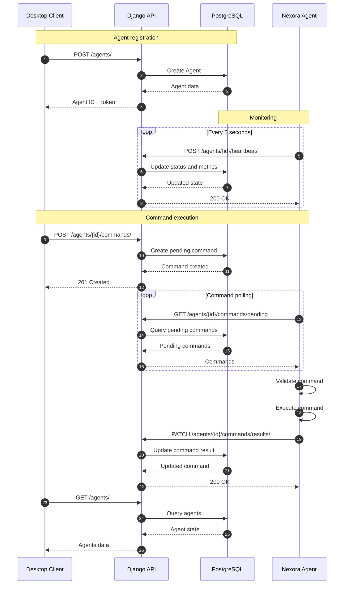

# NexoraControl


NexoraControl is a distributed server monitoring and control system built with Django, Python, and PySide6.

## Components

### Backend
* Django REST Framework
* PostgreSQL
* Agent management
* Monitoring
* Command lifecycle

### Agent
* Python
* System monitoring
* Command execution
* Docker support
* systemd deployment

### Desktop
* PySide6
* Agent monitoring
* Command management
* REST API client
* Background processing

## Features
* Agent registration and authentication
* CPU and RAM monitoring
* Online / offline detection
* Remote command execution
* Docker and system commands
* Command validation
* Command result handling
* Agent recovery
* Automated Agent installation
* Docker Compose deployment

## System Architecture



## Installation

### 1. Backend
Clone the repository on the server:

```bash
git clone [https://github.com/kapusta123b/NexoraControl.git](https://github.com/kapusta123b/NexoraControl.git)
cd NexoraControl
```

Configure the environment and start the backend:

```bash
docker compose up -d --build
```

Apply migrations:

```bash
docker compose exec web python manage.py migrate
```

### 2. Agent
On the VPS you want to monitor:

```bash
curl -fsSL [https://raw.githubusercontent.com/kapusta123b/NexoraControl/main/agent/install.sh](https://raw.githubusercontent.com/kapusta123b/NexoraControl/main/agent/install.sh) | sudo bash
```

The installer downloads the Agent, creates its virtual environment, installs dependencies, configures systemd, and starts the initial setup. During setup, provide the API URL and machine name. 

Check the Agent status:

```bash
sudo systemctl status nexora-agent
```

View logs:

```bash
sudo journalctl -u nexora-agent -f
```

### 3. Desktop
Run the Desktop Client:

```bash
cd desktop
python main.py
```

The Desktop Client connects to the Django API and provides monitoring and control of registered Agents.

## Project Structure

```text
NexoraControl/
├── agent/
├── backend/
├── desktop/
├── conf.d/
├── docker-compose.yml
└── README.md
```

## License
MIT
